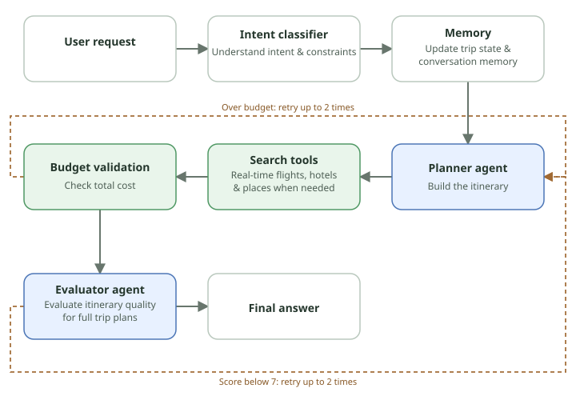

# Travelmate

A conversational travel planner built in Python. Users can plan trips through a local web interface or CLI, upload images, and revise their requirements. The agent searches for flights, hotels, and places; checks trip budgets; and evaluates itinerary quality before responding. **It does not book flights or hotels.**

## Architecture



The blue nodes are tool-using agents; the green nodes are tools (external searches and a deterministic budget check). The diagram shows a full itinerary request. `intent.py` makes one LLM classification call to identify the request and explicit changes to trip requirements. `memory.py` preserves trip state and summarizes older turns. If supplied requirements materially conflict, the classifier asks for clarification before planning. `agent.py` orchestrates the planner and any replans, while `tools/` supplies real search results and budget calculations. The separate evaluator agent in `evaluator.py` uses read-only tools to recheck budget arithmetic and inspect flight and hotel evidence before scoring itinerary quality. Its findings guide the planner's next revision. After the retry limit, the agent explains an unresolved budget shortfall or returns the latest quality revision.

## Setup and run

The following commands use Windows PowerShell. From the project root:

```powershell
py -3 -m venv venv
.\venv\Scripts\python.exe -m pip install openai python-dotenv serpapi
```

Create a `.env` file with your own credentials:

```dotenv
OPENAI_API_KEY=your_openai_api_key
SERPAPI_API_KEY=your_serpapi_api_key
```

Start the web interface:

```powershell
.\venv\Scripts\python.exe web_app.py
```

Open <http://127.0.0.1:8000>. The server listens on localhost only.

During planning, the chat and Agent Activity panel show the current task and completed tool actions as they happen, including searches, budget checks, evaluation, and replanning.

Once you like an itinerary, choose **Edit & export** on its response. A separate page lets you revise a Markdown copy with a live preview and download it as `.md`. The draft stays in the current browser tab; it does not alter the agent's original plan or budget check.

Start the CLI instead with:

```powershell
.\venv\Scripts\python.exe main.py
```

CLI commands: `/image` attaches an image, `/memory` displays trip memory, `/reset` clears conversation and memory, and `/exit` quits.

## Planning, memory, and budgets

- `trip_state` tracks origin, destination, traveler count, dates, hard constraints, soft preferences, selected flights and hotels, and user-locked selections. Explicit user updates replace earlier values.
- The five most recent user turns remain in short-term history; older dialogue is summarized. Web and CLI memory is in-process only and is lost when the application restarts.
- A trip with a total budget uses `check_budget`. An over-budget plan triggers up to two budget replans. An itinerary with an evaluator average below 7 triggers up to two quality replans. `max_rounds=8` limits model/tool rounds **within one planning attempt.**
- When a budget has no explicit currency, the agent defaults to the departure location's currency when recognized (for example, USA to USD). Explicit currency takes precedence. The mapping in `utils/currency.py` covers selected departure locations, so unfamiliar origins still depend on intent classification. Flight and hotel searches use the resulting budget currency. `check_budget` only adds numbers: it does not convert currencies.
- If dates are undecided, the agent can offer a flexible plan, but it must not invent date-specific flights, prices, or availability. Listed options are not reservations.

## Tests

Run unit tests without calling external APIs:

```powershell
.\venv\Scripts\python.exe -m unittest discover -s tests -p 'test_*.py'
```

List selected cases from the 50-case suite without executing them:

```powershell
.\venv\Scripts\python.exe tests/run_cases.py --ids 1 6 21
```

Execute selected cases with real OpenAI and search API calls, saving results to a separate file:

```powershell
.\venv\Scripts\python.exe tests/run_cases.py --ids 1 6 21 --execute --output tests/results/smoke.jsonl
```

Each JSONL record includes tool traces, deterministic rule checks, production evaluator scores, independent reviewer results, and token usage. `tests/results/smoke.summary.json` aggregates case statuses and tokens. By default, a run overwrites the selected output file; use `--resume` to keep it and skip valid completed results. See [test-case expectations](tests/EXPECTED_BEHAVIOR.md) for the review rules.

Additional details: [web interface](WEB.md), [multimodal input](MULTIMODAL.md), and [memory](MEMORY.md).
